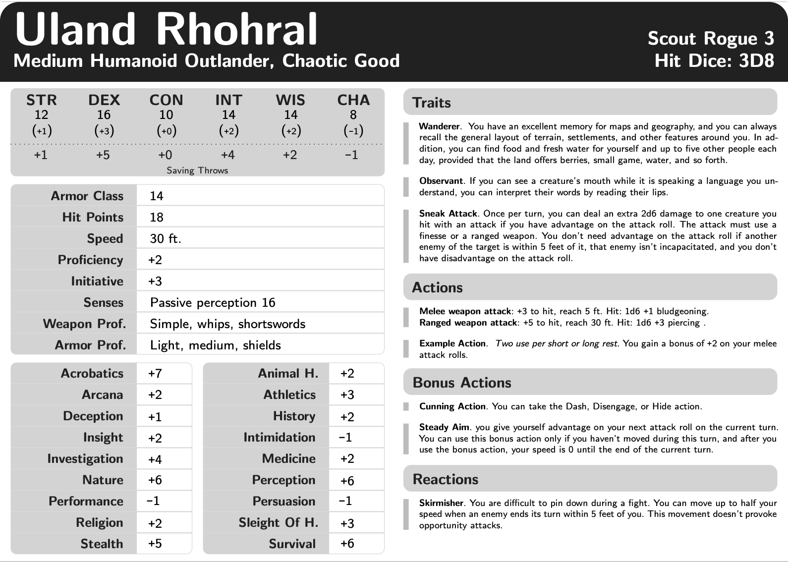
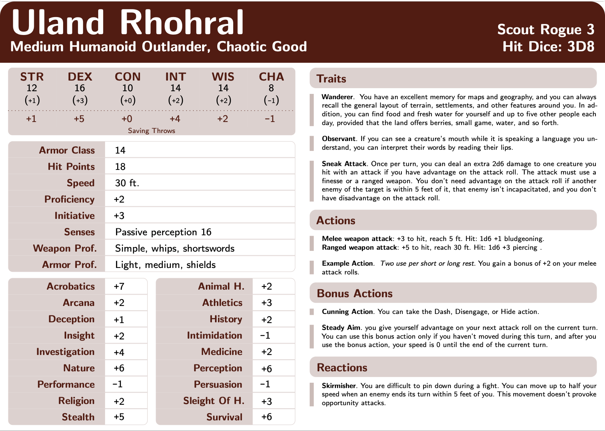

# DND5e-A6CharacterSheet

Automated character sheet generator on a A6 notecard for DND 5e using LaTeX.

The sheet currently automatically computes:
  1. Stat modifiers 
  2. Saving throws 
  3. Skill bonus
  4. Proficiency bonus
  5. Initiative bonus
  6. Passive perception
  7. Advantage on stat & skill rolls

It also automatically show/hide sections (Traits, Bonus Actions, Reactions, ...) 

If you do not have a LaTeX environment, you can copy the overleaf project at : https://www.overleaf.com/read/pzwxvfkthbfv
## Configuration

To modify the sheet, look for the section "YOUR CHARACTER STATS HERE" from line 145 to "DO NOT CHANGE ANYTHING BELOW HERE" at line 259. 
You can also change the color scheme at line 100. 

## Sample cards 

